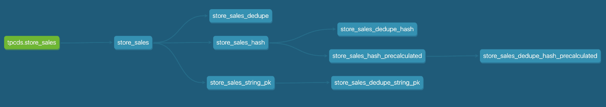

# Composite primary keys - To hash or not to hash?

> [!NOTE]  
> Work in Progress

I've always assumed that hashing improves the performance of queries which joins or windows on multiple columns.

Following this [conversation](https://www.linkedin.com/feed/update/urn:li:activity:7194671376593571843?commentUrn=urn%3Ali%3Acomment%3A%28activity%3A7194671376593571843%2C7194744468422467586%29&dashCommentUrn=urn%3Ali%3Afsd_comment%3A%287194744468422467586%2Curn%3Ali%3Aactivity%3A7194671376593571843%29) with [Toby Mao](https://github.com/tobymao), I wanted to investigate the impact of hashing when using [Athena](https://aws.amazon.com/athena/).

This repo deduplicates the table the [TPC-DS](https://www.tpc.org/tpcds/) `store_sales` table using `ROW_NUMBER()` and partitioning on the primary keys, comparing the run time for different approaches. 
The results show that hashing does **not** speed up run-time, and in fact causes a small increase at the scales I've investigated.

## Results

Metrics obtained when using scale = 500

### Staging Tables:

| Model | Rows | Runtime | Notes | 
|-|-|-|-|
|store_sales| 1,439,979,468 |626.21s| Creates a table with some duplicates|
|store_sales_hash|-|-|Creates view with hash|
|store_sales_string_pk|1,439,979,468|662.35s|Converts integer PKs to string|
|store_sales_hash_precalculated |1,439,979,468 |744.22s|Creates table with hash|

### Deduping

| Model | Rows | Runtime | Notes | 
|-|-|-|-|
|store_sales_dedupe|1,439,978,468|744.31s|Deduplicates `store_sales` using primary keys|
|store_sales_dedupe_hash|1,439,978,468|858.69s|Deduplicates `store_sales` using dynamic hash|
|store_sales_dedupe_hash_precalculated|1,439,978,468|865.41s|Deduplicates `store_sales_hash_precalculated` using pre-calculated hash|
|store_sales_dedupe_string_pk|1,439,978,468|784.73s|Deduplicates `store_sales_string_pk` using string primary keys|



## Instructions

You will need to have a copy of the TPC-DS store_sales table. I used the [TPC-DS connector for AWS Glue](https://aws.amazon.com/marketplace/pp/prodview-xtty6azr4xgey) to generate the TPC-DS `store_sales` table at scale 1 and 500, but you can use any method to create your table at any scale that Athena can handle.

This repo uses [dbt-core](https://github.com/dbt-labs/dbt-core) and [dbt-athena](https://github.com/dbt-athena/dbt-athena) adapter to manage and run the sql queries. To run locally, you'll have to follow the [setup instructions](https://dbt-athena.github.io/docs/getting-started/installation) and update `profiles.yml` with your bucket settings. You might also need to update the `source.yaml` to match your database name.

To run against TPCDS scale=1:

```
dbt run 
```

To run against any other scale pass in the tpcds_scale variable:

```
dbt run --vars '{"tpcds_scale":"500"}'
```
